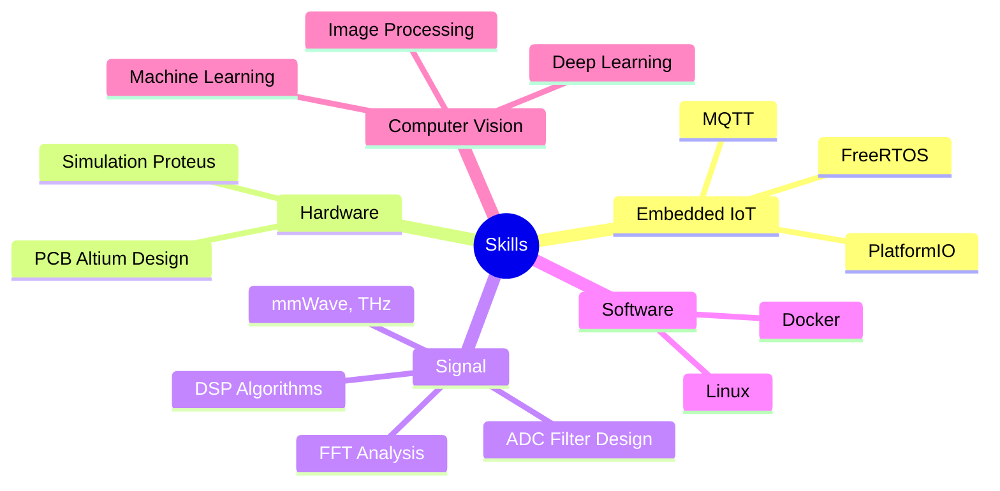

  

<h3 align="center">🎓 Da Nang University of Science and Technology</h3>

  

---

### 🌱 Current Focus

---
### 📂 Featured Projects
<table>
<tr>

<!-- LEFT SIDE - FEATURED PROJECTS -->
<td width="75%" valign="top">

<table>
<tr>
<th>Skill Area</th>
<th>Tech Stack</th>
<th>Featured Project</th>
<th>Status</th>
</tr>

<tr>
<td>🔌 IoT</td>
<td> MQTT, FreeRTOS</td>
<td><a href="https://github.com/bathanh0309/iot_freeaqua_rtos"><b>🐠Smart Aquarium</b></a></td> <td>✅</td>
</tr>

<tr>
<td>🔌 IoT</td>
<td> MQTT, Sensors</td>
<td><a href="https://github.com/bathanh0309/iot_parksense"><b>🚗Smart Parking</b></a></td><td>✅</td>
</tr>

<tr>
<td>🔌 IoT</td>
<td> Altium, PCB</td>
<td><a href="https://github.com/bathanh0309/iot_homehub"><b>🏠Home Hub</b></a></td><td>✅</td>
</tr>

<tr>
<td>📡 Signal</td>
<td>MATLAB, Simulink</td>
<td><a href="https://github.com/bathanh0309/sp_simu_ADC"><b>🔬ADC Simulation</b></a></td><td>✅</td>
</tr>

<tr>
<td>📡 Signal</td>
<td>mmWave, THz, DSP</td>
<td><a href="https://github.com/bathanh0309/sp_mmWave_THz"><b>🛰️mmWave Research</b></a></td><td>✅</td>
</tr>

<tr>
<td>📡 Signal</td>
<td>Analog, Power Electronics</td>
<td><a href="https://github.com/bathanh0309/sp_Amplifier_OTL"><b>🔊OTL Amplifier</b></a></td><td>✅</td>
</tr>

<tr>
<td>🤖 AI/CV</td>
<td>  Linux, C++</td>
<td><a href="https://github.com/bathanh0309/json_RRT"><b>🗺️RRT Path Planning</b></a></td><td>🔄</td>
</tr>

<tr>
<td>🤖 AI/CV</td>
<td>  Docker, PlatformIO</td>
<td><a href="https://github.com/bathanh0309/json_Vision_Gate"><b>📊Vision Gate</b></a></td><td>🔄</td>
</tr>

<tr>
<td>🤖 AI/CV</td>
<td>  Jupyter, TensorFlow</td>
<td><a href="https://github.com/bathanh0309/machine_learning"><b>🧠Machine Learning</b></a></td><td>🔄</td>
</tr>

<tr>
<td>🤖 AI/CV</td>
<td>  TensorFlow, OpenCV</td>
<td><a href="https://github.com/bathanh0309/deep_learning"><b>🔮Deep Learning</b></a></td><td>🔄</td>
</tr>

<tr>
<td>🤖 AI/CV</td>
<td> OpenCV, Python</td>
<td><a href="https://github.com/bathanh0309/image_processing"><b>👁️Image Processing</b></a></td><td>🔄</td>
</tr>

</table>

</td>

<!-- RIGHT SIDE - HIGHLIGHTS -->
<td width="35%" valign="top">

### 🎯Achievements

</td>

</tr>
</table>

---

<table>
<tr>
<td width="50%" valign="top">

  

  

</td>
<td width="50%" valign="top">

  

  

</td>
</tr>
</table>

  

    
   
  

🎓 📍🏛️ 🔥🔌📡🤖 👨‍💻 💻🎯💡👁️📊❤️

