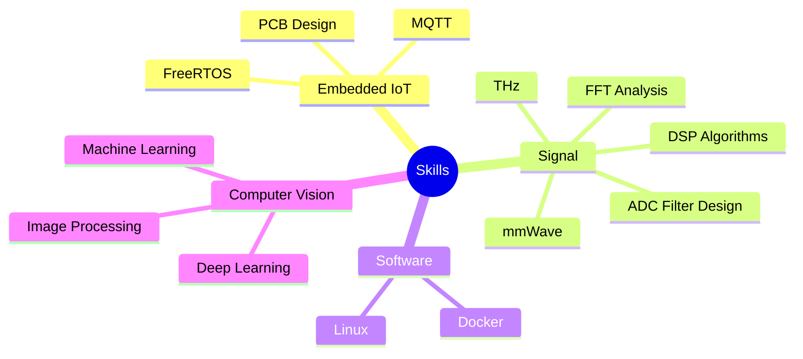

<p align="center">
  
</p>

<h3 align="center">🎓 Da Nang University of Science and Technology</h3>
<p align="center">
  
</p>

<table>
<tr>
<td width="60%" valign="top">

### 🎓 Education
📍 Da Nang University of Science and Technology  
🏛️ Faculty of Electronics and Telecommunication Engineering
🔥🔌📡🤖 👨‍💻 💻🎯


### 🤝 Let's Connect
<p align="center">
    <a href="https://zalo.me/0935636090" target="_blank"
   style="display:inline-flex;align-items:center;gap:10px;background:#0068FF;color:#fff;padding:8px 14px;border-radius:8px;text-decoration:none;font-weight:700;">
  </a>
   <a href="mailto:bathanh124ads@gmail.com" target="_blank"
   style="display:inline-flex;align-items:center;gap:10px;background:#D14836;color:#white;padding:8px 14px;border-radius:8px;text-decoration:none;font-weight:700;">
</a>
  <a href="https://www.linkedin.com/in/bathanh0309" target="_blank"
   style="display:inline-flex;align-items:center;gap:10px;background:#0077B5;color:#white;padding:8px 14px;border-radius:8px;text-decoration:none;font-weight:700;">
  </a>

### 📡 Signal Processing Projects

| Tech Stack | Repository | Level | Status |
|:-----------|:-----------|:-----:|:------:|
| 📊 🔬 | [**sp_simuADC**](https://github.com/bathanh0309/sp_simu_ADC)<br/><sub>📈 Advanced ADC Signal Simulation</sub> | ⭐⭐⭐⭐ | ✅ |
| 📡 🛰️ | [**sp_mmWave_THz**](https://github.com/bathanh0309/sp_mmWave_THz)<br/><sub>🌊 Millimeter Wave & THz Research</sub> | ⭐⭐ | ✅ |
| ⚡ 🔊 | [**sp_Amplifier_OTL**](https://github.com/bathanh0309/sp_Amplifier_OTL)<br/><sub>🎵 OTL Power Amplifier Design</sub> | ⭐⭐⭐⭐ | ✅ |


</td>
<td width="40%" valign="top">

<p align="center">
  
</p>

<p align="center">
  
</p>

<p align="center">
  
</p>


### 🏅 Quick Highlights

<div align="left">

[](https://drive.google.com/file/d/1tr2x93TwjTtUAfHl8ggOcIgXE5LCZisv/view)

[](https://drive.google.com/file/d/1iI_mmLu6SrupykpjnciBaJUs4rW604Rp/view)

[](https://drive.google.com/file/d/1Nn8-F5u36uuBbKG1-ddfdwV_-vlJIkSc/view)

[](https://drive.google.com/file/d/1VZz2rVPJsuUwPL--lmYGkaremqqJL9eP/view)

[](https://drive.google.com/file/d/1_k1gOUejFIOUj8iQCzT4rLdRF-s7Xugo/view)


[](https://drive.google.com/file/d/14Vq_sYqdfCSVpm4K6qnyK41LR1ABLt9C/view)


[](https://drive.google.com/file/d/1IS7MKVRLEAUrxG3UAmzJelLf3vWU4Bb1/view)


[](https://drive.google.com/file/d/1GZvRcehhXUOCUiw5jLp3gS9lZ-kPk8T2/view)


</div>

</td>
</tr>
</table>


### 🌱 Current Focus

---

## 💼 Project Portfolio

<div align="center">

```yaml
Legend:
  ⭐⭐⭐⭐ Expert Level
  ⭐⭐⭐ Advanced
  ⭐⭐ Intermediate
  ⭐ Learning
  ✅ Production Ready     |  🔄 In Development
```

</div>

<table>
<tr>
  <td width="50%" valign="top">

### 🚀 IoT & Embedded Projects

| Tech Stack | Repository | Level | Status |
|:-----------|:-----------|:-----:|:------:|
|    | [**iot_freeaqua_rtos**](https://github.com/bathanh0309/iot_freeaqua_rtos)<br/><sub>🐠 Smart Aquarium Monitoring with FreeRTOS</sub> | ⭐⭐⭐⭐ | ✅ |
|   | [**iot_parksense**](https://github.com/bathanh0309/iot_parksense)<br/><sub>🚗 IoT-based Smart Parking System</sub> | ⭐⭐⭐ | ✅ |
|  | [**iot_homehub**](https://github.com/bathanh0309/iot_homehub)<br/><sub>🏠 Central Smart Home Control Hub</sub> | ⭐⭐⭐ | ✅ |

### 📡 Signal Processing Projects

| Tech Stack | Repository | Level | Status |
|:-----------|:-----------|:-----:|:------:|
| 📊 🔬 | [**sp_simuADC**](https://github.com/bathanh0309/sp_simu_ADC)<br/><sub>📈 Advanced ADC Signal Simulation</sub> | ⭐⭐⭐⭐ | ✅ |
| 📡 🛰️ | [**sp_mmWave_THz**](https://github.com/bathanh0309/sp_mmWave_THz)<br/><sub>🌊 Millimeter Wave & THz Research</sub> | ⭐⭐ | ✅ |
| ⚡ 🔊 | [**sp_Amplifier_OTL**](https://github.com/bathanh0309/sp_Amplifier_OTL)<br/><sub>🎵 OTL Power Amplifier Design</sub> | ⭐⭐⭐⭐ | ✅ |

### 🤖 AI & Computer Vision

| Tech Stack | Repository | Level | Status |
|:-----------|:-----------|:-----:|:------:|
|   | [**json_RRT**](https://github.com/bathanh0309/json_RRT)<br/><sub>🗺️ RRT Path Planning Algorithm</sub> | ⭐ | ✅ |
|   | [**json_Vision_Gate**](https://github.com/bathanh0309/json_Vision_Gate)<br/><sub>👁️ AI-Powered Gate Recognition</sub> | ⭐⭐ | 🔄 |
|   | [**machine_learning**](https://github.com/bathanh0309/machine_learning)<br/><sub>🧠 ML Algorithms & Models</sub> | ⭐⭐ | 🔄 |
|   | [**deep_learning**](https://github.com/bathanh0309/deep_learning)<br/><sub>🔮 Deep Neural Networks</sub> | ⭐⭐ | 🔄 |
|  | [**image_processing**](https://github.com/bathanh0309/image_processing)<br/><sub>🖼️ Computer Vision Projects</sub> | ⭐⭐ | 🔄 |

  </td>
  <td width="50%" valign="top">

### 🏆 Achievements & Certifications

<table>
<tr>
  <td width="70%" align="left"><b>Award / Certificate</b></td>
  <td width="30%" align="center"><b>Verify</b></td>
</tr>
<tr>
  <td align="left">
    🏆 <b>President's Honor List</b><br/>
    <sub>Outstanding Academic Achievement</sub>
  </td>
  <td align="center">
    <a href="https://drive.google.com/file/d/1tr2x93TwjTtUAfHl8ggOcIgXE5LCZisv/view" target="_blank">
      
    </a>
  </td>
</tr>
<tr>
  <td align="left">
    🥇 <b>1st Place - Faculty Competition</b><br/>
    <sub>Electronics & Telecommunications</sub>
  </td>
  <td align="center">
    <a href="https://drive.google.com/file/d/1iI_mmLu6SrupykpjnciBaJUs4rW604Rp/view" target="_blank">
      
    </a>
  </td>
</tr>
<tr>
  <td align="left">
    🥈 <b>2nd Place - Innovation Ideas</b><br/>
    <sub>Creative Project Competition</sub>
  </td>
  <td align="center">
    <a href="https://drive.google.com/file/d/1Nn8-F5u36uuBbKG1-ddfdwV_-vlJIkSc/view" target="_blank">
      
    </a>
  </td>
</tr>
<tr>
  <td align="left">
    🥉 <b>3rd Place - High School Competition</b><br/>
    <sub>Provincial Science Contest</sub>
  </td>
  <td align="center">
    <a href="https://drive.google.com/file/d/1VZz2rVPJsuUwPL--lmYGkaremqqJL9eP/view" target="_blank">
      
    </a>
  </td>
</tr>
<tr>
  <td align="left">
    🏅 <b>Honorable Mention - UDN</b><br/>
    <sub>University Research Award</sub>
  </td>
  <td align="center">
    <a href="https://drive.google.com/file/d/1_k1gOUejFIOUj8iQCzT4rLdRF-s7Xugo/view" target="_blank">
      
    </a>
  </td>
</tr>
<tr>
  <td align="left">
    🏅 <b>Honorable Mention - Research Paper</b><br/>
    <sub>Scientific Publication Award</sub>
  </td>
  <td align="center">
    <a href="https://drive.google.com/file/d/14Vq_sYqdfCSVpm4K6qnyK41LR1ABLt9C/view" target="_blank">
      
    </a>
  </td>
</tr>
<tr>
  <td align="left">
    📜 <b>NVIDIA Deep Learning Institute</b><br/>
    <sub>Fundamentals of Deep Learning</sub>
  </td>
  <td align="center">
    <a href="https://drive.google.com/file/d/1IS7MKVRLEAUrxG3UAmzJelLf3vWU4Bb1/view" target="_blank">
      
    </a>
  </td>
</tr>
<tr>
  <td align="left">
    📜 <b>DSAC IC Design Certificate</b><br/>
    <sub>Integrated Circuit Design</sub>
  </td>
  <td align="center">
    <a href="https://drive.google.com/file/d/1GZvRcehhXUOCUiw5jLp3gS9lZ-kPk8T2/view" target="_blank">
      
    </a>
  </td>
</tr>
<tr>
  <td align="left">
    📜 <b>Scientific Research Certificate</b><br/>
    <sub>Research Methodology</sub>
  </td>
  <td align="center">
    <a href="https://drive.google.com/file/d/1NluBnhDf06USY6wm1r2R16zXldbwUppn/view" target="_blank">
      
    </a>
  </td>
</tr>
</table>

  </td>
</tr>
</table>

---

<p align="center">
  
</p>

<p align="center">
  
</p>

---

<p align="center">
  
</p>

<div align="center">

### 💡 *"High standards, eager to learn, responsible and reputable"*

**Open for collaborations on:**  
🔌 Embedded Systems • 📡 IoT Solutions • 👁️ Computer Vision • 📊 Signal Processing

[](mailto:bathanh124ads@gmail.com)
[](https://www.linkedin.com/in/bathanh0309)
[](https://zalo.me/0935636090)

<sub>Made with ❤️ by Ba Thanh | Last Updated: November 2025</sub>

</div>
