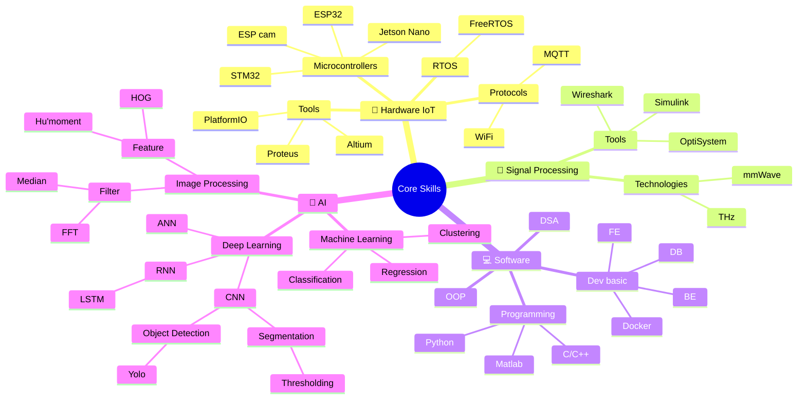

  

<h3 align="center">🎓 Da Nang University of Science and Technology</h3>

  

---
<table>
<tr>

<!-- LEFT SIDE - FEATURED PROJECTS -->
<td width="50%" valign="top">

<table>
<tr>
<th>👨‍💻Area</th>
<th>💻Technology</th>
<th>📂My Project</th>
<th>📊Done</th>
</tr>

<tr>
<td>Hardware Embedded</td>
<td>Altium, MQTT, wifi, FreeRTOS, App</td>
<td><a href="https://github.com/bathanh0309/iot_freeaqua_rtos"><b>🐠Smart Aquarium</b></a></td> <td>✅</td>
</tr>

<tr>
<td>Hardware Embedded</td>
<td>Altium, MQTT, ESP32, Web</td>
<td><a href="https://github.com/bathanh0309/iot_parksense"><b>🚗Smart Parking</b></a></td><td>✅</td>
</tr>

<tr>
<td>Hardware Embedded</td>
<td>Altium, DC/AC, sensors, Arduino</td>
<td><a href="https://github.com/bathanh0309/iot_homehub"><b>🏠Home Hub</b></a></td><td>✅</td>
</tr>

<tr>
<td>Signal</td>
<td>Matlab, Simulink, Filter</td>
<td><a href="https://github.com/bathanh0309/sp_simu_ADC"><b>🔬ADC Simulation</b></a></td><td>✅</td>
</tr>

<tr>
<td>Signal</td>
<td>mmWave, THz, LSTM</td>
<td><a href="https://github.com/bathanh0309/sp_mmWave_THz"><b>🛰️mmWave & THz</b></a></td><td>✅</td>
</tr>

<tr>
<td>Signal</td>
<td>Altium, Proteus, Oscilloscope</td>
<td><a href="https://github.com/bathanh0309/sp_Amplifier_OTL"><b>🔊OTL Amplifier</b></a></td><td>✅</td>
</tr>

<tr>
<td>Computer Science</td>
<td>Algorithm, Yolov3, Jetson Nano</td>
<td><a href="https://github.com/bathanh0309/json_RRT"><b>🗺️RRT Path Planning</b></a></td><td>🔄</td>
</tr>

<tr>
<td>Computer Science</td>
<td>MQTT, PlatformIO, ESP32, Yolov8</td>
<td><a href="https://github.com/bathanh0309/json_Vision_Gate"><b>📊Vision Gate</b></a></td><td>🔄</td>
</tr>

<tr>
<td>Computer Science</td>
<td>Jupyter, TensorFlow</td>
<td><a href="https://github.com/bathanh0309/machine_learning"><b>🧠Machine Learning</b></a></td><td>🔄</td>
</tr>

<tr>
<td>Computer Science</td>
<td>TensorFlow, Pytorch</td>
<td><a href="https://github.com/bathanh0309/deep_learning"><b>🔮Deep Learning</b></a></td><td>🔄</td>
</tr>

<tr>
<td>Computer Science</td>
<td>OpenCV, Python</td>
<td><a href="https://github.com/bathanh0309/image_processing"><b>👁️Image Processing</b></a></td><td>🔄</td>
</tr>

</table>

</td>

<!-- RIGHT SIDE - HIGHLIGHTS -->
<td width="50%" valign="top">

### 🤝 Let's Connect

  
    
   
  
  

</td>
</tr>
</table>

---

### 🌱 Roadmap

  

