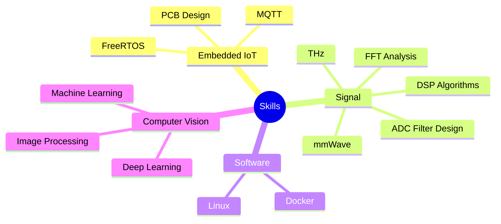

  

<h3 align="center">🎓 Da Nang University of Science and Technology</h3>

  

  <!-- CV -->
  <a href="https://drive.google.com/file/d/1QunYtVMWaOimxyrPYxE3dwwVKhu1n0Tn/view?usp=drive_link" target="_blank"
     style="display:inline-flex;align-items:center;gap:6px;background:#ffffff;border:1px solid #0068FF;color:#0068FF;padding:6px 12px;border-radius:8px;text-decoration:none;font-weight:700;">
    
    My CV
  </a>

  <!-- Zalo -->
  

  <!-- Gmail -->
  

  <!-- LinkedIn -->
  

<table>
<tr>
<td width="60%" valign="top">

### 💼 Featured Projects

| Area | Repositories |
|:-----|:-------------|
| 🚀 **IoT & Embedded** |   [**iot_freeaqua_rtos**](https://github.com/bathanh0309/iot_freeaqua_rtos) – Smart Aquarium (FreeRTOS)   [**iot_parksense**](https://github.com/bathanh0309/iot_parksense) – Smart Parking  [**iot_homehub**](https://github.com/bathanh0309/iot_homehub) – Home Automation Hub |
| 📡 **Signal Processing** | 📊 [**sp_simuADC**](https://github.com/bathanh0309/sp_simu_ADC) – ADC Signal Simulation 📡 [**sp_mmWave_THz**](https://github.com/bathanh0309/sp_mmWave_THz) – mmWave & THz 🔊 [**sp_Amplifier_OTL**](https://github.com/bathanh0309/sp_Amplifier_OTL) – OTL Amplifier |
| 🤖 **AI & Computer Vision** |   [**json_RRT**](https://github.com/bathanh0309/json_RRT) – RRT Path Planning   [**json_Vision_Gate**](https://github.com/bathanh0309/json_Vision_Gate) – Vision Gate   [**machine_learning**](https://github.com/bathanh0309/machine_learning)   [**deep_learning**](https://github.com/bathanh0309/deep_learning)  [**image_processing**](https://github.com/bathanh0309/image_processing) |

</td>
<td width="40%" valign="top">

### 🌱 Current Focus

